# JDBC-STUDENT-MANAGEMENT-SYSTEM :star_struck:

[](https://shields.io/) [](https://shields.io/) [](https://shields.io/) [](https://shields.io/) [](https://shields.io/) [](https://shields.io/)
<br>
***This new Web application is created by Biswarup Bhattacharjee, student of BTECH, in University of Engineering and Management, Kolkata.***

**Email Id: bbiswa471@gmail.com.** 

**Contact No: 916290272740.** 

[](https://www.facebook.com/biswarup.bhattacharjee.5811) [](https://github.com/biswa2210)

## About :point_down: 


## Purpose :point_down:


## Use :point_down:

## Applications and Future Scopes:point_down:


## Folder Structure :point_down:
```bash

     ├── .idea

     └── rootwallpaper.jpg 
```                       

## Making :point_down:


## Screenshots :point_down: 
<div align="center">
<a href="cms1.png">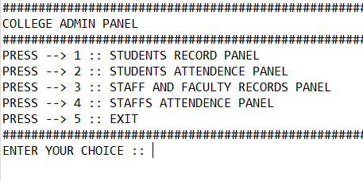</a> <a href="cms2.png">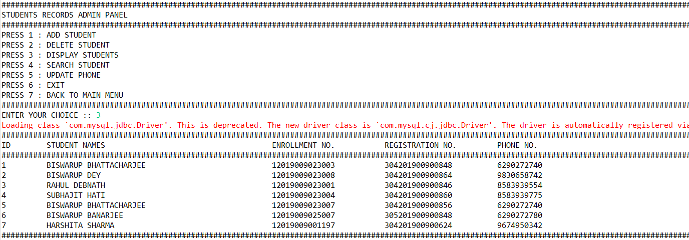</a>

<a href="cms3.png">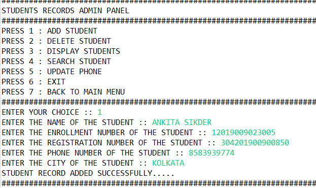</a> <a href="cms4.png">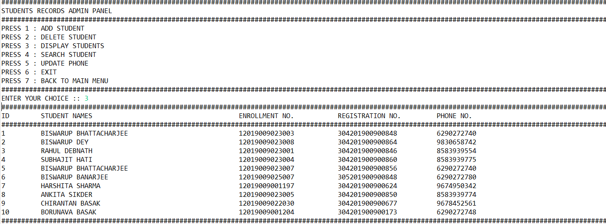</a>

<a href="cms5.png">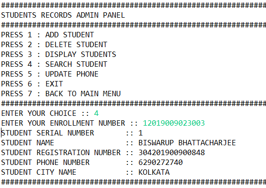</a> <a href="cms6.png">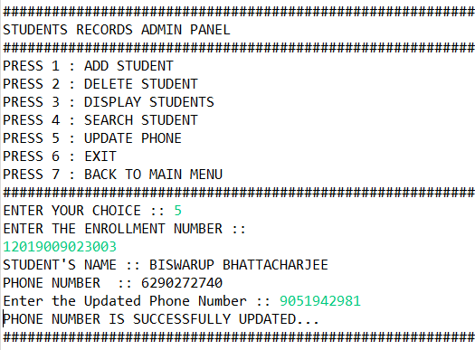</a>

<a href="cms7.png">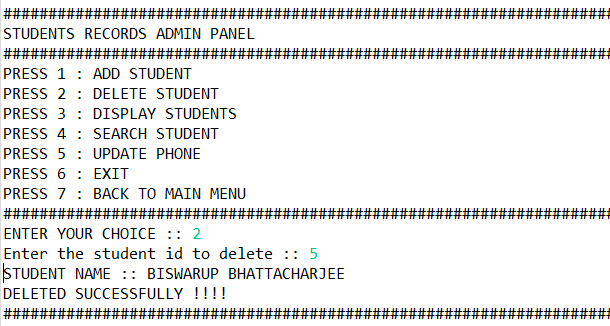</a> <a href="cms8.png">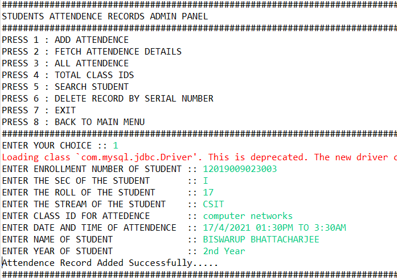</a>

<a href="cms9.png">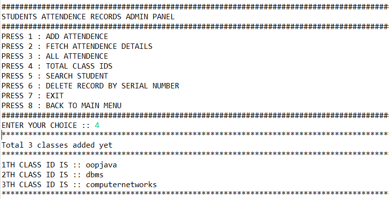</a> <a href="cms10.png">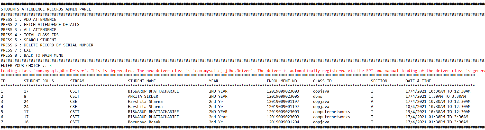</a>

<a href="cms11.png"></a> <a href="cms12.png">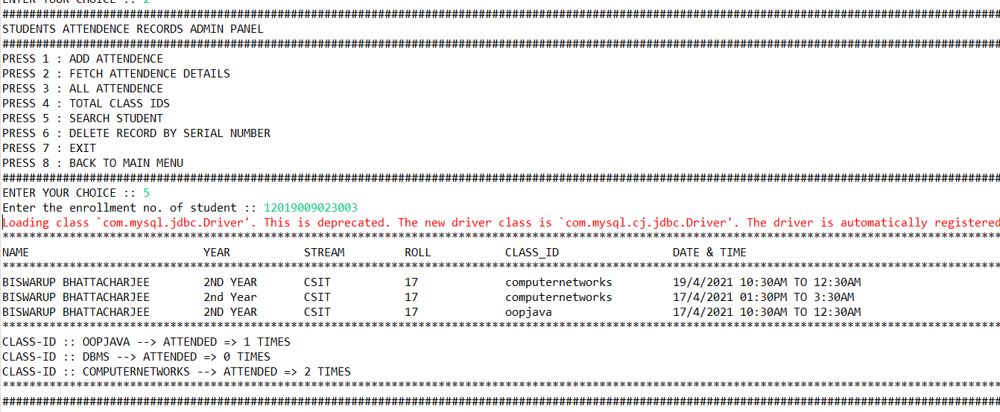</a>

<a href="cms13.png">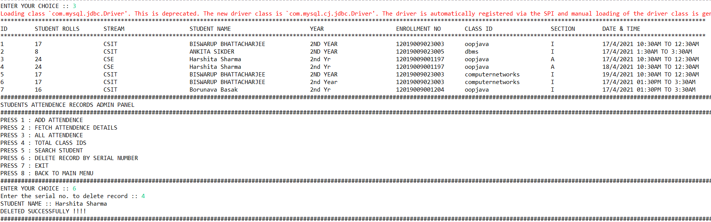</a> <a href="cms14.png">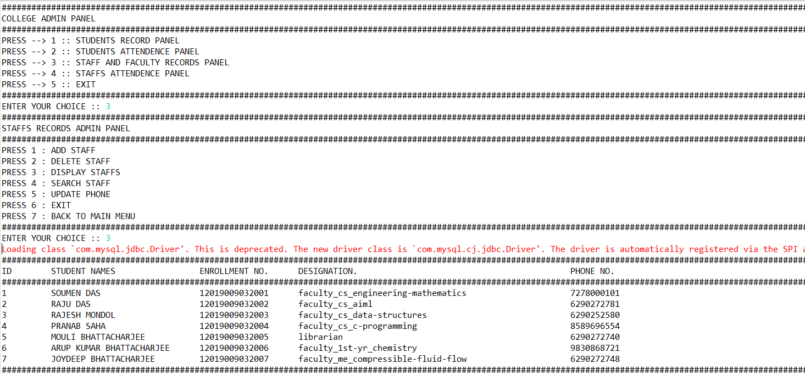</a>

<a href="cms15.png">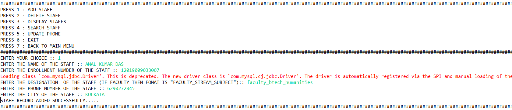</a> <a href="cms16.png">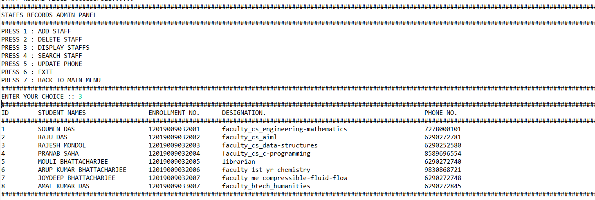</a>

<a href="cms17.png">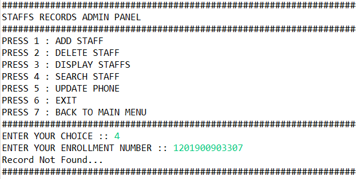</a> <a href="cms18png">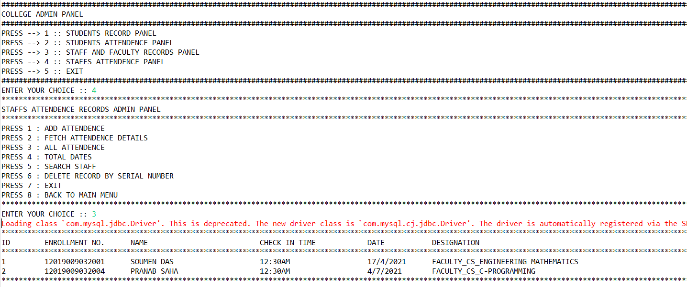</a>

<a href="cms19.png">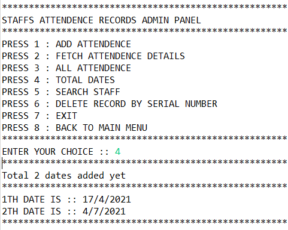</a> <a href="cms20.png">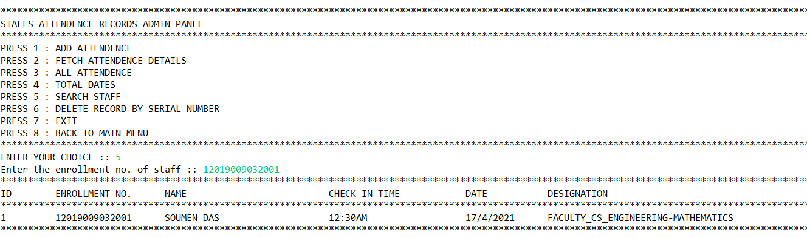</a>

<a href="cms21.png">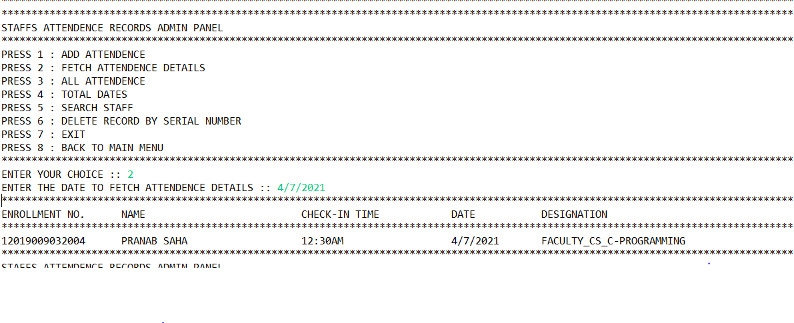</a> <a href="cms22.png">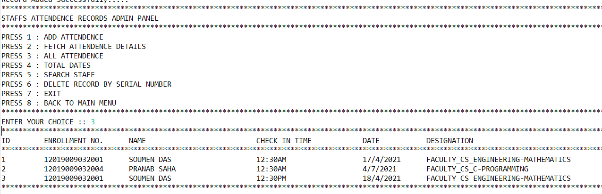</a>

<a href="cms23.png">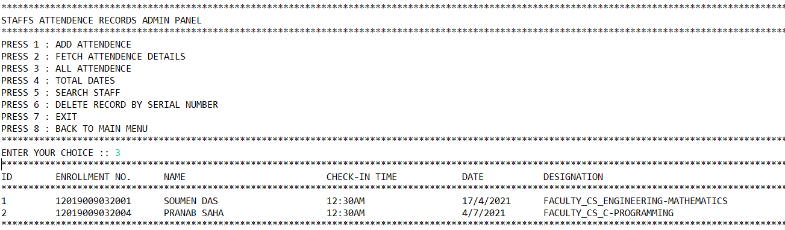</a> 


</div>


